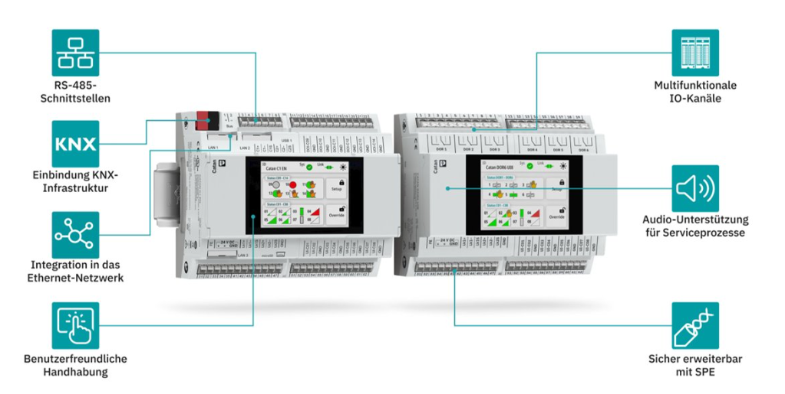
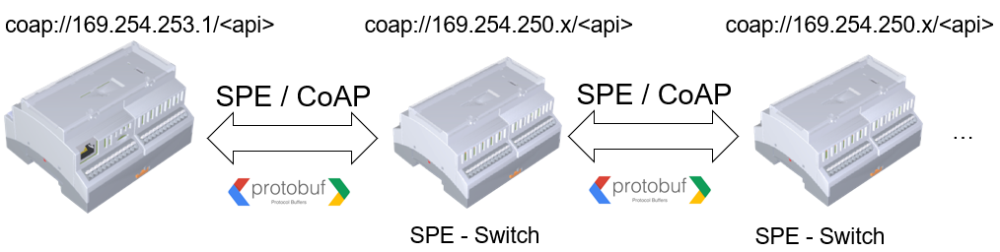
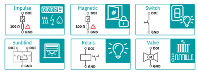
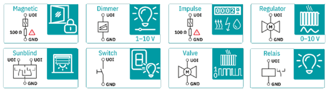
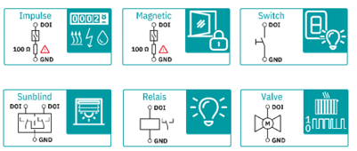

# CatanIO

This project provides an introduction to the CatanIO API and supplies all required files to integrate custom software on the Catan C1 platform. It is intended to support developers in building their own applications that run on the Catan C1 and interact directly with the available input and output channels.

## Module Overview

Module: CATAN C1 \
Description: Catan C1 controller \
Article number: 1886438  \
Product website: http://www.phoenixcontact.net/product/1886438

Module: CATAN DOR6 UI8 \
Description: Relay module \
Article number: 1371364 \
Product website: http://www.phoenixcontact.net/product/1371364

Module: CATAN DOI8 UOI8 UI8 \
Description: Input/output module \
Article number: 1818583 \
Product website: http://www.phoenixcontact.net/product/1818583

Module: CATAN DALI4 DOI8  \
Description: Dali module \
Article number: Comming soon, under development \
Product website: 

## Addons

Module: CATAN CONTROL PANEL  \
Description: Display \
Article number: 1371366 \
Product website: http://www.phoenixcontact.net/product/1371366

## Directory Descriptions

apps/
* Recommendations for app development on Catan C1

changelog/
* feature changelog
* The full changelog can be found in the firmware archive on the product website.

examples_container/
* Container deployment examples

protobuf/
* `com/` RS485 settings and Protobuf for deactivating communication functions
* `dali/`Protobuf files and README for DALI-specific devices
* `doi/` Digital Input and Digital Output
* `dor/` Relay outputs
* `shared/` Shared Protobuf definitions for data types
* `sys/` System properties
* `ui/` Universal Input
* `uoi/`Universal Output and Digital Input

## General API Information

All modules can be accessed via IP addresses through a RESTful API, using the CoAP protocol. For serialization and API description, Google Protocol Buffers is used. 

The modules can be connected to the Catan C1 controller in two lines or as an RSTP ring. A maximum of 16 modules per controller is recommended.

The IP addresses are assigned by a DHCP server. The modules can be discovered on the network via multicast using CoAP.

### Input and output states

Each input and output has defined states.

States can represent, among other things:
- operating states
- error states
- diagnostic information

The states are implemented in a type-based manner and are therefore consistent across all modules.

## Protobuf Basics

The Protobuf files are not structured per module, but are shared across all modules.
They describe functional types, states, and properties – not individual hardware instances.

- Shared Protobuf files apply across modules
- Module-specific Protobuf files exist only where functionality is clearly tied to a specific module

### Examples

- sys,shared.proto
  Applies to all devices and modules
  Contains system-wide properties (e.g. identity, status, basic functionality)

- dor.proto
  Applies exclusively to the relay module (DOR)
  Contains only relay-specific functions and states

- ui,uoi,doi.proto
  Applies to all devices and modules that provide the corresponding channels.
  Contains IO specific functions and states

### Catan C1

* 3 physical gigabit ethernet ports, default are LAN1+LAN2 switched
* 2 RS485 - e.g. Modbus RTU, Bacnet MSTP, DMX ....
* 1 KNX TP, KNX IP and KNX Router 
* 2 physical SPE T1L with 10Mbit/s for addon modules

### UI - Universal input

* Analog: U, I, R, RTD, NTC
* Dry contacts, signal levels according to EN 61131‑2 (Type 2 + 3)
* Counter

### UOI - Univsersal output and digital input

* Dry contacts 
* Counter	
* Digital out 24 V 500 mA
* Analog out 0…10 V

    

### DOI - Digital output and digital input

* Dry contacts
* Counter	
* Digital out 24 V / 500 mA

## Display control functions

The following display functions are available for inputs and outputs:

- Allow override directly via the display
- Display override can be reset from application
- Freely definable name for display purposes
- Display of a unit (e.g. %, V, A, °C)

These functions are available consistently across modules,
provided the respective type is supported.