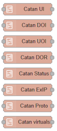
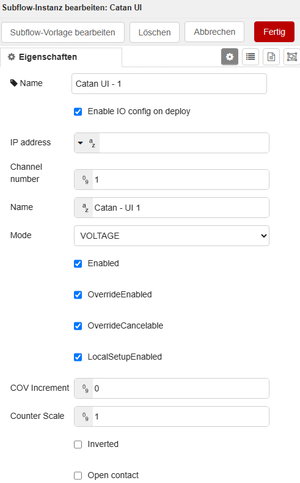

# Node-RED on Catan

> [!WARNING]
> This project is experimental.
>
> The provided Node-RED flows are intended as examples and templates for
> evaluating and integrating Catan I/O modules. Interfaces, message formats,
> Subflow parameters and Protobuf definitions may change.
>
> Carefully test all read, write and configuration operations before using
> the flows in a production environment.

This example shows how to run Node-RED on a Catan device with access to
Catan I/O modules, USB devices and RS485 interfaces.

The repository also contains example flows for configuring, reading and
writing Catan I/O channels using CoAP and Protobuf.

Two deployment options are available:

- Podman Compose
- systemd service (rootless Podman)

## Option 1: Podman compose

### Service overview

- Uses the official `nodered/node-red:latest` image
- Automatically restarts unless stopped manually
- Exposes the Node-RED web interface on port `1880`
- Stores persistent data in `./nodered`

### Compose file

```yaml
services:
  node-red:
    image: docker.io/nodered/node-red:latest
    restart: unless-stopped
    environment:
      - TZ=Europe/Amsterdam
    ports:
      - "1880:1880"
    volumes:
      - ~/nodered:/data
# USB serial
      - /dev/usb-devices:/dev/usb-devices
    devices:
# RS485(2)     
      - /dev/ttymxc2:/dev/ttymxc2
# RS485(1)      
      - /dev/ttymxc3:/dev/ttymxc3

# Permissions for the admin user
    userns_mode: keep-id
    user: 1002:1002
```

### Create directory

```bash
mkdir ~/nodered
```

### Start

```bash
podman compose up -d
```

### Stop

```bash
podman compose down
```

## Option 2: systemd service (rootless Podman)

This variant runs Node-RED as a native systemd user service.

### Service file

Create:

```bash
nano ~/.config/systemd/user/nodered.service
```

```ini
[Unit]
Description=Node-RED rootless Podman container
After=network-online.target
Wants=network-online.target

[Service]
Restart=always
RestartSec=10
ExecStartPre=/usr/bin/mkdir -p ~/nodered
ExecStartPre=-/usr/bin/podman rm -f nodered

ExecStart=/usr/bin/podman run \
  --name nodered \
  --rm \
  --userns=keep-id \
  --user 1002:1002 \
  --env TZ=Europe/Amsterdam \
  --publish 1880:1880 \
  --volume ~/nodered:/data \
  --device /dev/ttymxc2:/dev/ttymxc2 \
  --device /dev/ttymxc3:/dev/ttymxc3 \
  docker.io/nodered/node-red:latest

ExecStop=/usr/bin/podman stop nodered
ExecStopPost=-/usr/bin/podman rm -f nodered

TimeoutStartSec=120
TimeoutStopSec=30

[Install]
WantedBy=default.target
```

### Enable and start

Reload systemd:

```bash
systemctl --user daemon-reload
```

Enable automatic startup:

```bash
systemctl --user enable nodered.service
```

Start the service:

```bash
systemctl --user start nodered.service
```

Check status:

```bash
systemctl --user status nodered.service
```

View logs:

```bash
journalctl --user -u nodered.service -f
```

Stop Node-RED:

```bash
systemctl --user stop nodered.service
```

## Node-RED dependencies

The following Node-RED addons are required:

- CoAP addon (used in IO subflows for Catan):  
  https://flows.nodered.org/node/node-red-contrib-coap

- Display addon (minimum Node-RED 5.0, used for status information in flows):  
  https://flows.nodered.org/node/node-red-contrib-display

- Protobufjs (used in IO subflows for Catan):  
  Will be installed on first deploy from example flow. Internet is required. 

### Connectivity

- KNX addon:  
  https://flows.nodered.org/node/node-red-contrib-knx-ultimate  
  Requires a KNX interface configured on the controller IP address.

- Modbus TCP and RTU addon:  
  https://flows.nodered.org/node/node-red-contrib-modbus

- Serial port: 
  node-red-node-serialport  

- Bacnet addon: 
  https://flows.nodered.org/node/node-red-contrib-bacnet

- OPCUA addon: 
  https://flows.nodered.org/node/node-red-contrib-opcua

- PLCnext: 
  https://flows.nodered.org/node/@kjgalr/node-red-plc-next-connector    

### Application

- Timer Sun, Moon, Blind flow control:  
  https://github.com/rdmtc/node-red-contrib-sun-position

- Complex timer:  
  https://flows.nodered.org/node/node-red-contrib-cron-plus  

- Logic addon:  
  https://flows.nodered.org/node/node-red-contrib-boolean-logic-ultimate

- Alarm states  
  https://flows.nodered.org/node/node-red-contrib-alarm-ultimate

### Dashboards

- Flowfuse  
  https://flows.nodered.org/node/@flowfuse/node-red-dashboard

- UIBUILDER  
  https://flows.nodered.org/node/node-red-contrib-uibuilder


## Interfaces

### USB serial

- All USB serial devices are exposed via `/dev/usb-devices`
- Allows integration of gateways such as:
  - M-Bus
  - wM-Bus
  - EnOcean
  - Modbus RTU USB adapters
  - ...

### RS485

- `/dev/ttymxc3` → RS485(1)
- `/dev/ttymxc2` → RS485(2)

Typical use cases:

- Modbus RTU
- M-Bus gateways
- Proprietary RS485 devices
- DMX


## Usage

Open Node-RED:

```text
http://<device-ip>:1880
```

---

## Catan flow overview

The Catan Node-RED example is organized into reusable Subflows.

A dedicated Subflow is provided for each supported Catan I/O type. Each
Subflow encapsulates the communication, message generation and optional
channel configuration for its I/O type.

The flow contains Subflows for:



Each I/O Subflow can be instantiated multiple times. The properties of an
instance define the channel number, channel name, operating mode and other
I/O-specific settings.

The I/O Subflows provide separate outputs for:

- Read responses
- Write responses
- Configuration responses

## Flow templates

Separate flow templates are provided for the available Catan module
combinations:

| Template | Description |
|---|---|
| Catan C1 | Template for the I/Os provided directly by the Catan C1 |
| DOR6 UI8 | Template for a Catan extension module with six relay outputs and eight universal inputs |
| DOI8 UOI8 UI8 | Template for a Catan extension module with digital I/Os, universal I/Os and universal inputs |
| Dali MM4 DOI8 | Coming soon |

The templates can be imported independently and adapted to the actual
hardware configuration.

Unused channels or complete module templates can be removed from the
imported flow.

## IP address configuration

The IP address used for Catan communication can be configured in two ways.

### Central IP address

The IP address can be defined centrally and passed to the individual I/O
Subflows.

This is useful if all channels in a flow communicate with the same Catan
controller or extension module.

### IP address per Subflow

The IP address can also be configured individually for each Subflow
instance.

This allows channels from different Catan controllers or extension modules
to be used in the same Node-RED flow.

An IP address configured directly on a Subflow instance overrides the
central IP address for that instance.

> [!NOTE]
> Make sure that Node-RED can reach all configured IP addresses through the
> appropriate network interface.

## Subflow configuration

Each I/O Subflow can generate the configuration for its channel.

The configuration is created from the properties defined on the Subflow
instance. Depending on the I/O type, these properties can include:

- Channel number
- Channel name
- Operating mode
- Enable state
- Override behavior
- Default values
- Counter settings
- Analog settings
- Additional I/O-specific parameters

### Example UI   


This makes it possible to manage the I/O configuration directly through
the properties of the individual Node-RED Subflow instances.

The configuration can be applied in two ways:

1. Automatically when the Node-RED flow is deployed
2. Explicitly by sending a message containing `msg.catan_config`

## Catan operation properties

The Catan I/O Subflows use the presence of specific message properties to
select the requested operation.

The value assigned to these properties is not evaluated. Only the presence
of the property is relevant.

The following properties are supported:

- `msg.catan_config`
- `msg.catan_read`
- `msg.catan_write`

For example, all of the following messages contain a valid operation
trigger:

```javascript
msg.catan_read = "";
```

```javascript
msg.catan_read = true;
```

```javascript
msg.catan_read = {};
```

## Configuring an I/O channel

### `msg.catan_config`

The presence of `msg.catan_config` triggers a configuration operation.

The property can be used independently of the automatic configuration
performed during deployment.

Example:

```javascript
msg.catan_config = "";
return msg;
```

There are two possible ways to use `msg.catan_config`.

### Automatic configuration on deploy

Each I/O Subflow provides the following option:

```text
Enable IO config on deploy
```

This option controls whether the Subflow automatically applies its
configured I/O settings when the Node-RED flow is deployed.

### Custom configuration from Node-RED

A Node-RED flow can also use `msg.catan_config` to apply its own
configuration.

This makes it possible to create or modify the configuration dynamically
before passing the message to the I/O Subflow.

Example structure:

```javascript
msg.catan_config = "";

msg.payload = {
    // Custom I/O configuration
};

return msg;
```

The exact payload structure depends on the I/O type, operating mode and
corresponding Protobuf message.

When using custom configurations, the `Enable IO config on deploy` option
should be deactivated to prevent the Subflow from overwriting the custom
configuration on each deploy.

Note that deactivating `Enable IO config on deploy` only disables the
automatic configuration performed during deployment. Configuration
operations triggered by `msg.catan_config` remain available.

## Reading an I/O channel

### `msg.catan_read`

The presence of `msg.catan_read` triggers a read operation.

Example:

```javascript
msg.catan_read = "";
return msg;
```

Only the presence of `msg.catan_read` is evaluated. Its value is ignored.

The decoded channel value is returned through the read response output of
the Subflow.

The exact response structure depends on:

- I/O type
- Configured operating mode
- Catan firmware
- Corresponding Protobuf response type

Read operations are independent of the `Enable IO config on deploy`
setting.

A channel can therefore be read even if its configuration is managed by
another application.

### Example read UI:

```javascript
{
  "type":"UI_TYPE_AI_VOLTAGE",
  "status":"STATUS_FAILURE",
  "errorCode":"ERR_SENSOR_NOT_CONN",
  "overrideRemainingMs":0,
  "digitalVal":false,
  "analogVal":0,
  "counterVal":"0",
  "onTimeS":0,
  "sensorVal":null,
  "testStatus":"TEST_OPEN"
}
```

## Writing an I/O channel

### `msg.catan_write`

The presence of `msg.catan_write` triggers a write operation.

The value to be written is provided through `msg.payload`.

Only the presence of `msg.catan_write` is evaluated. Its value is ignored.

Write operations are independent of the `Enable IO config on deploy`
setting.

A channel can therefore be written even if its configuration is managed by
another application.

> [!NOTE]
> The required payload property depends on the I/O type and its configured
> operating mode.

## Example write triggers

Example Inject nodes are included in the templates.

These Inject nodes demonstrate how values can be written to the different
Catan I/O types. They can be used as starting points for
application-specific logic.


### Write a digital value

Set a digital output to `true`:

```javascript
msg.catan_write = "";

msg.payload = {
    digitalSetVal: true
};

return msg;
```

Set a digital output to `false`:

```javascript
msg.catan_write = "";

msg.payload = {
    digitalSetVal: false
};

return msg;
```

### Write an analog value

Example for writing a numeric value:

```javascript
msg.catan_write = "";

msg.payload = {
    analogSetVal: 5.0
};

return msg;
```

The available value properties depend on the I/O type and operating mode.

Use the included example Inject nodes as the reference for the
corresponding Subflow.

> [!CAUTION]
> Writing an output can immediately affect connected equipment.
>
> Verify the selected controller, extension module, channel, operating mode
> and value before triggering a write operation.

## Catan Status and keep-alive

Each Catan module requires a cyclic keep-alive message (default one time in 15 minutes).

The `Catan Status` Subflow is responsible for the keep-alive communication
with the corresponding module.
If multiple extension modules are used, each module requires its own
`Catan Status` instance.
The `Catan Status` Subflow must use the same IP address as the I/O Subflows
assigned to that module.


## Discovering extension modules with Catan ExIP

The `Catan ExIP` Subflow can be used to find Catan extension modules and
their assigned IP addresses.

The discovered address can be:

- Displayed for commissioning and diagnostics
- Passed to the corresponding module flow
- Used as the central IP address for the module
- Assigned individually to the module's I/O Subflows

### Example discover result
```javascript
{
  "status":"IDLE",
  "progress":"100%",
  "foundCount":3,
  "ipAddresses":["169.254.250.242",
                 "169.254.250.240",
                 "169.254.250.218"]
  }
```