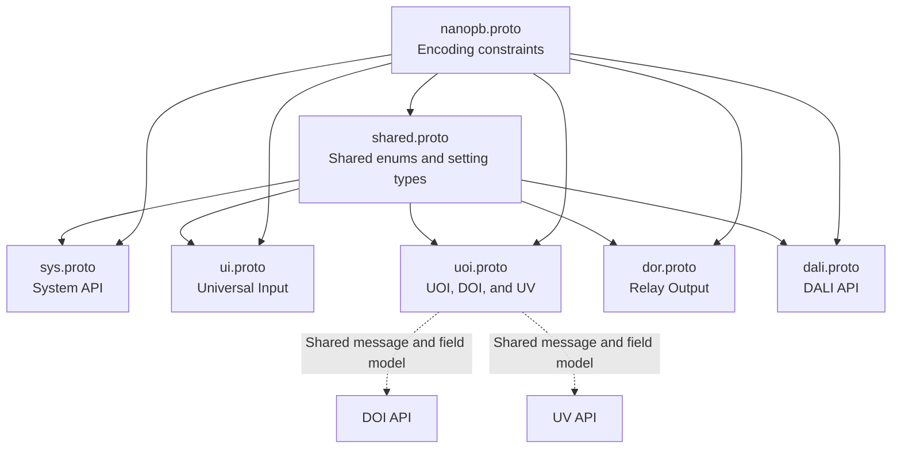
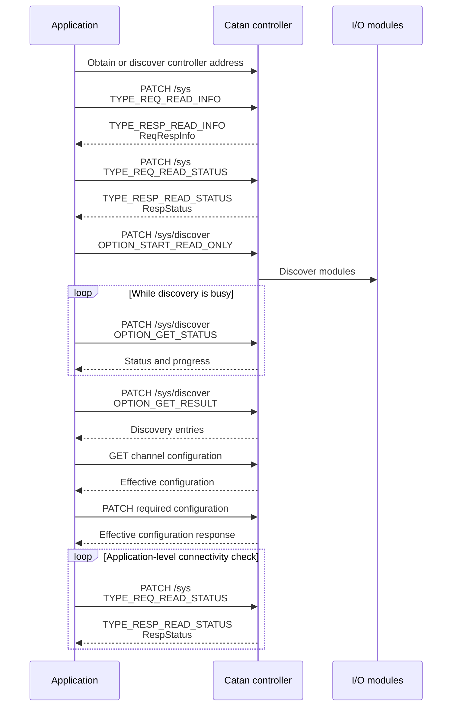

# CatanIO Protobuf API

## Overview

This directory contains the Protocol Buffer definitions and interface documentation used by the CatanIO CoAP API.

The API provides access to:

- Universal Inputs
- Universal Outputs
- Digital Input and Output channels
- Virtual Output channels
- Relay outputs
- DALI functionality
- System configuration and diagnostics
- Device and extension-module discovery
- Common data types shared by the interfaces

The schemas use:

```text
Serialization: Protocol Buffers, proto3
Transport:     CoAP
Constraints:   nanopb options
```

The `.proto` files define the binary request and response payloads exchanged with the corresponding CoAP resources.

The nanopb annotations define embedded-codec constraints such as:

- Maximum string lengths
- Maximum repeated-field counts
- Fixed byte-array lengths

The active `.proto` files are authoritative for:

- Message names
- Field names
- Field numbers
- Field types
- Enum names and values
- Size constraints
- Reserved fields and enum values
- Message dependencies

Additional documentation may define behavior that is not represented directly in the Protobuf schema, such as device defaults, endpoint behavior, timing requirements, or firmware-specific limitations.

## General architecture

| Property | Value |
|---|---|
| Transport | CoAP |
| Serialization | Protocol Buffers using `proto3` |
| Embedded codec constraints | nanopb options |
| I/O API style | Interface-specific request and response messages |
| Generic system container | `SysMessage` |
| Generic payload selection | `oneof payload`, interpreted together with `msg_type` |

The System API contains two related messaging concepts:

1. Direct endpoints with endpoint-specific request and response messages
2. Generic system operations transported through `SysMessage`

For example, the system configuration endpoint uses concrete messages:

```text
PATCH coap://<ip>:5683/sys/cfg -> SysCfgReq
GET   coap://<ip>:5683/sys/cfg -> SysCfgResp
```

Generic system operations use:

```text
PATCH coap://<ip>:5683/sys -> SysMessage
```

`SysMessage` selects the requested operation using `msg_type` and carries the corresponding operation-specific payload in a `oneof`.

A client must not assume that every payload sent to a documented CoAP endpoint must additionally be wrapped in `SysMessage`. The expected message type is determined by the endpoint definition.

## References

- [RFC 7252 – The Constrained Application Protocol (CoAP)](https://www.rfc-editor.org/info/rfc7252)
- [RFC 6690 – Constrained RESTful Environments (CoRE) Link Format](https://www.rfc-editor.org/info/rfc6690)
- [RFC 7641 – Observing Resources in CoAP](https://datatracker.ietf.org/doc/html/rfc7641)
- [RFC 6762 – Multicast DNS](https://datatracker.ietf.org/doc/html/rfc6762)
- [RFC 6763 – DNS-Based Service Discovery](https://www.rfc-editor.org/info/rfc6763)

Support for CoRE resource discovery through `/.well-known/core` is device- and firmware-specific and must be verified for the target device. RFC 6690 is included as a general CoAP reference and does not imply that every CatanIO device exposes the CoRE Link Format discovery resource.

## Directory overview

| Directory | Purpose |
|---|---|
| [`shared/`](./shared/) | Common enums, setting types, point states, I/O error codes, calibration structures, and helper messages |
| [`sys/`](./sys/) | System configuration, discovery, networking, time, firmware, topology, identification, and other system-level operations |
| [`ui/`](./ui/) | Universal Input configuration and runtime values for Analog Input, Digital Input, and Counter modes |
| [`uoi_doi_uv/`](./uoi_doi_uv/) | UOI, DOI, and UV configuration and runtime values based on the UOI message model |
| [`dor/`](./dor/) | Dedicated relay-output interface with Digital Output, switching-counter, and on-time functions |
| [`dali/`](./dali/) | DALI API definitions and documentation |

## Interface overview

| Interface | Endpoint prefix | Supported functions |
|---|---|---|
| UI | `/ui` | Analog Input, Digital Input, and Counter Input |
| UOI | `/uoi` | Analog Voltage Output, Digital Output, Digital Input, and Counter Input |
| DOI | `/doi` | Digital Output, Digital Input, and Counter Input using the UOI message definitions |
| UV | `/uv` | Digital Output and Analog Voltage Output using the UOI message definitions |
| DOR | `/dor` | Fixed relay-output mode |
| System | `/sys` | System configuration, discovery, status, diagnostics, networking, time, and device information |
| DALI | `/dali` | DALI functionality |

The exact interfaces, supported functions, and channel ranges depend on the device model.

## I/O endpoint structure

Channel-oriented I/O resources generally use:

```text
coap://<ip>:<port>/<interface>/<channel>
coap://<ip>:<port>/<interface>/<channel>/cfg
```

Examples:

```text
coap://169.254.1.10:5683/ui/1
coap://169.254.1.10:5683/ui/1/cfg
coap://169.254.1.10:5683/uoi/13
coap://169.254.1.10:5683/dor/1/cfg
```

The endpoint interface and channel number correspond to the I/O type and terminal designation of the device.

## Configuration and runtime resources

I/O interfaces normally expose separate configuration and runtime resources.

### Configuration resource

```text
/<interface>/<channel>/cfg
```

Typical operations:

```text
GET   /<interface>/<channel>/cfg
PATCH /<interface>/<channel>/cfg
```

The configuration resource may contain channel parameters such as:

- Enabled state
- Operating type, where applicable
- Channel name
- Override permissions
- Signal-processing options
- Default-value behavior
- Limits and fault thresholds
- Display texts
- Local-setup permission
- Wiring-test state

### Runtime resource

```text
/<interface>/<channel>
```

Typical operations:

```text
GET   /<interface>/<channel>
PATCH /<interface>/<channel>
```

Depending on the interface and active operating mode, the runtime resource may contain:

- Process values
- Normal output set values
- Sensor-level values
- Actuator values
- Counter values
- On-time values
- Initialization values
- Override commands and values
- Point status
- I/O error status
- Wiring-test status

## Protobuf dependencies

The interface-specific schemas reuse common definitions from `shared.proto`.

For example, `ui.proto` imports:

```proto
syntax = "proto3";

import "shared.proto";
import "nanopb.proto";
```

It can then use shared types:

```proto
message UiCfgReq {
    BooleanSetting enabled = 1;
    UiType type = 2;
    String64Setting name = 3;
}
```

The following types are not redefined inside `ui.proto`:

```text
BooleanSetting
String64Setting
PointStatus
IoErrorCode
OverrideAction
TestStatus
```

They are defined centrally in `shared.proto`.

### Dependency structure



The dotted relationships represent functional reuse:

- DOI uses the UOI message definitions.
- DOI supports Digital Output, Digital Input, and Counter Input.
- DOI does not support Analog Output.
- UV uses the UOI message definitions.
- UV supports Digital Output and Analog Voltage Output.
- UOI supports all concrete UOI operating modes.

The actual imports and active message definitions remain authoritative.

## Include paths and code generation

The imports use names such as:

```text
shared.proto
nanopb.proto
```

The compiler must be given include directories from which these files can be resolved.

An example command is:

```bash
protoc \
  -I protobuf/shared \
  -I protobuf/ui \
  -I protobuf/uoi_doi_uv \
  -I protobuf/dor \
  -I protobuf/sys \
  -I protobuf/dali \
  -I <path-to-nanopb> \
  --descriptor_set_out=catanio.pb \
  --include_imports \
  protobuf/ui/ui.proto \
  protobuf/uoi_doi_uv/uoi.proto \
  protobuf/dor/dor.proto \
  protobuf/sys/sys.proto \
  protobuf/dali/dali.proto
```

DOI and UV are not added as separate `.proto` files because they use the UOI message definitions.

Generator options depend on the target language and installed compiler plugins. Examples include:

```text
--cpp_out
--python_out
--java_out
--go_out
--nanopb_out
```

The required plugins and command-line syntax must be taken from the selected Protobuf and nanopb toolchain.

## System communication summary

Detailed system-level documentation is provided in [`sys/README.md`](./sys/README.md).

The following sections summarize typical client interactions with the System API.

### System-status request

System status is read through the generic `SysMessage` endpoint:

```text
PATCH /sys
```

Request:

```json
{
  "msgType": "TYPE_REQ_READ_STATUS",
  "reqRespEmpty": {}
}
```

Response:

```json
{
  "msgType": "TYPE_RESP_READ_STATUS",
  "respStatus": {
    "pointsInFailure": 0,
    "pointsOverridden": 0,
    "displayConnected": true,
    "ctrlConnected": true,
    "buttonPressed": false,
    "ctrlConnectFailure": false
  }
}
```

Field semantics are described in [`sys/README.md`](./sys/README.md).

`ctrl_connected` and `ctrl_connect_failure` represent different states and must not be treated as aliases.

### Controller-connection monitoring

Catan I/O devices monitor communication with the control unit through the system-level configuration field:

```proto
Uint32Setting ctrl_connect_failure_timeout_s = 1;
```

The default value of the timeout is device- or integration-specific and is not encoded as a default value in `sys.proto`.

If communication with the control unit remains interrupted for the configured period, outputs configured with:

```text
use_default_val_on_failure = true
```

may switch to their configured default value.

The Protobuf schema does not define which requests reset the controller-connection monitoring timer. A client must therefore not assume that a system-status request acts as a protocol-level keep-alive unless this behavior has been verified for the target firmware. A periodic system-status request may still be used as an application-level connectivity check.

### Device and module discovery

Discovery distinguishes between two tasks:

1. Finding a Catan controller or another reachable CatanIO device on the IP network.
2. Discovering devices or extension modules through a known Catan controller or I/O backend.

These tasks do not necessarily use the same protocol operation.

Backend-side discovery through a known controller uses:

```text
PATCH /sys/discover
```

See [`sys/README.md`](./sys/README.md) for the request options, status codes, and result structure.

Network-level discovery may use Catan-specific multicast or broadcast communication. Known target addresses include:

```text
coap://224.0.1.187:5683/
coap://169.254.255.255:5683/
```

These target addresses are not equivalent to standard CoRE Link Format discovery. The exact request payload, expected response type, response collection window, and firmware-specific behavior must follow the Catan network-discovery specification.

Clients should avoid rapid repeated multicast or broadcast requests.

### Device identity after discovery

After a device address has been obtained, device information is read through:

```text
PATCH /sys
```

with:

```json
{
  "msgType": "TYPE_REQ_READ_INFO",
  "reqRespEmpty": {}
}
```

The response contains a `ReqRespInfo` payload. The active field definitions, field lengths, and byte encodings in `sys.proto` remain authoritative.

Applications should not rely solely on a DHCP-assigned IP address as a stable device identity. The preferred stable identifier must be defined by the device-management architecture.

## CoAP Observe

CoAP Observe allows a client to register interest in a resource and receive updated representations over time.

Observe is defined as a best-effort mechanism. The generic CoAP specification does not define a universal maximum number of Observe relationships that every server must support. Observe support and limits must be verified for each CatanIO resource and target firmware.

A client should:

- Register only the Observe relationships it requires.
- Re-register after a device restart.
- Use retry backoff after communication failure.
- Continue validating `status`, `error_code`, and the active operating mode.
- Avoid assuming that every `GET` resource supports Observe.

## CoAP implementation limits

Firmware-specific limits such as the following are not defined in the Protobuf schemas:

- Maximum number of concurrent Confirmable requests
- Maximum number of concurrent Non-confirmable requests
- Maximum request rate
- Maximum payload without Block1 or Block2
- Supported block-wise transfer sizes
- Maximum accepted token length
- Duplicate-message cache duration
- Retransmission parameters
- Idle endpoint-state timeout
- Maximum number of Observe relationships
- Multicast request-rate limits

Until verified limits are available, clients should use conservative resource usage.

## Non-normative client recommendations

The following recommendations are not part of the protocol contract.

### Requests

- Serialize configuration writes for the same channel.
- Avoid duplicate parallel writes.
- Use the response to verify the effective configuration.
- Use appropriate retry delays after communication errors.
- Do not assume that an omitted field retains its current value unless the corresponding setting semantics define that behavior.

### Observe

- Register only required resources.
- Reconnect Observe relationships after a device restart.
- Use backoff after failed registration or notification loss.
- Verify that Observe is supported by the selected resource.

### Discovery

- Avoid rapid repeated multicast or broadcast requests.
- Collect responses within a defined response window.
- Use read-only backend discovery unless address assignment is explicitly required.
- Do not use `OPTION_START_ADDRESS_ALL` as a general discovery default.

### Connectivity monitoring

- Treat a successful system-status response as evidence that the API is reachable.
- Do not assume that it resets the device's controller-connection timeout.
- Configure the application request interval below the intended connectivity-detection threshold.
- Keep the request interval and retry policy configurable.

## Suggested client startup sequence



Observe registration may be added to this sequence after support and firmware-specific limits have been verified.